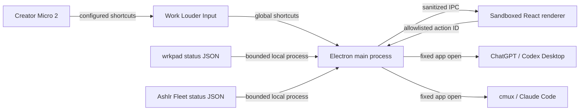

# Architecture and trust boundaries

Ashlr Agent Board is a local macOS observer and guarded action router. The renderer never receives a general shell, filesystem, or process API.

## System context

## Components

### React renderer

`src/` renders the board twin, attention runway, Fleet brief, setup, and Flight Check. It requests only methods exposed by `electron/preload.cjs`.

The browser window uses context isolation, disables Node integration, and enables Electron's sandbox. New windows, webviews, unexpected navigation, and renderer permission requests are denied. IPC handlers accept only the trusted main frame and configured local renderer URL.

### Preload and main process

The preload exposes named IPC calls rather than `ipcRenderer`. `electron/main.cjs` owns shortcuts, authorization, process execution, workspace selection, acceptance events, and receipts.

Actions resolve through `electron/action-registry.cjs`; unknown IDs fail closed. Renderer-supplied commands, executable paths, arguments, and app names are never executed.

The declared board route is a private local preference with only three values:
`unknown`, `codex_native`, and `ashlr_layer`. It never changes device state.
`electron/codex-micro-diagnostics.cjs` reads at most eight recent Codex log
tails, each capped at 2 MiB, and projects only a reason-coded native state,
timestamp, and fixed detail. Raw logs, private paths, task content, and unknown
fields never cross IPC.

### Local adapters

`electron/mission-control.cjs` resolves `wrkpad` and `ashlr` from `~/.local/bin`, `~/.npm-global/bin`, `/opt/homebrew/bin`, `/usr/local/bin`, or `/usr/bin`, then starts them without a shell. Runtime callers intentionally do not trust inherited `PATH` entries:

- `wrkpad status --json`, limited to 1.2 seconds;
- `ashlr fleet status --json`, limited to 6.5 seconds.

Each response is limited to 2 MiB. Agent data must use `dev.wrkpad.hasp.state/v1`. Fleet data must contain valid timestamp, daemon, queue, proposal, goal, and mission-brief fields. Timeout, nonzero exit, oversized output, malformed JSON, and schema failure become unavailable or invalid states.

The exact supported shapes, synthetic fixtures, structured validation reasons,
and upgrade policy are documented in [provider compatibility
contracts](provider-contracts.md). Ashlr's Fleet adapter version describes this
app's bounded projection; it is not an upstream schema or authority claim.

Mission snapshots expose only six bounded slot summaries, bounded Fleet facts, source-state labels, and recognized operator notices. Workspace Pulse is a distinct feature and intentionally displays the user-selected workspace path and bounded Git/toolchain facts.

## Provider integration

### Codex

`wrkpad` converts supported Codex lifecycle receipts into provider-neutral slot states. Selecting a Codex slot runs `open -a ChatGPT`; opening a workspace invokes the resolved Codex CLI as `codex app <workspace>`.

This is not yet a Codex app-server integration and cannot focus an exact task. No prompt or approval is submitted.

Codex provider lifecycle state and Codex's native Creator Micro control plane
are separate evidence sources. Provider hooks can populate the six-slot runway
while native firmware initialization is unavailable. Conversely, a native HID
connection does not prove provider hook trust or receipt delivery.

### Claude Code and cmux

`wrkpad` converts supported Claude Code hook events into the same state grammar. Selecting a Claude slot runs `open -a cmux`. The app does not correlate a slot with an exact cmux pane and sends no terminal input. Claude Desktop can be opened separately.

### Ashlr Hub

Agent Board reduces the local Fleet receipt to daemon state, queue counts, proposal count, active goals, operating mode, blocker, next action, and guard state.

This is a status receipt, not proof of remote authority, provider authentication, protected-branch policy, dispatch, release, or acceptance. Fleet pause/resume and daemon stop remain explicit continuous-hold actions delegated to Ashlr Hub.

## Safety invariants

1. AG00–AG05 keep their slot identity across lenses.
2. Focus can foreground a fixed app but cannot send a prompt or terminal input.
3. The renderer supplies an action ID, never a command.
4. Confirm and hold tokens expire after 30 seconds and are tied to window, action, and workspace.
5. Continuous hold duration is validated by the main process.
6. Flight Check clears approvals and suppresses mapped actions and slot focus.
7. Invalid or missing receipts remain invalid or unavailable.
8. Mission snapshots omit session IDs, provider cwd values, prompts, transcripts, tool arguments, and raw payloads.
9. Push, merge, deploy, publish, delete, spend, credential, and permission-approval executors are absent.
10. The screen remains authoritative; physical RGB and firmware transport are not claimed.

## Process and local-data boundaries

Tool discovery accepts safe executable names only and rejects path traversal. Inspection processes have a 20-second timeout and bounded displayed output. Terminal actions use a fixed allowlist, and workspace paths are shell-quoted before an allowlisted command is passed to macOS Terminal.

The selected workspace is stored under Electron user data. Flight receipts are created only at a user-chosen destination using an exclusive temporary file, atomic rename, and mode `0600`. Mission status is cached for eight seconds. No cloud service, telemetry sender, or updater exists in this repository.

Changes to IPC, executors, schemas, receipt content, hardware writes, or authority controls require tests and architecture review. See [contributing](../CONTRIBUTING.md#hardware-and-provider-changes).
